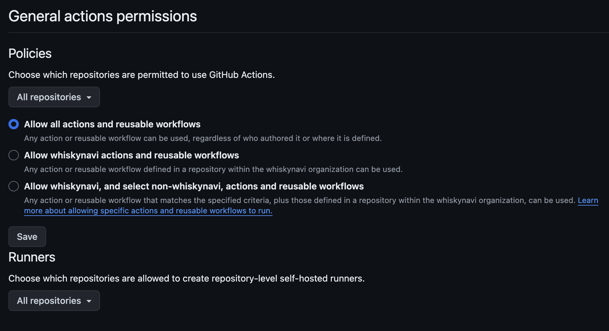
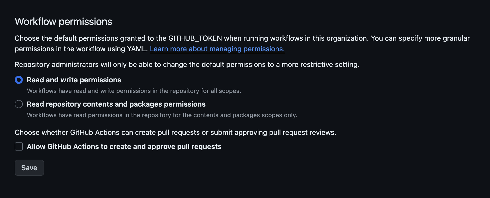

# BoilerPlate 세팅하는법

## Action 권한 설정 





## Actions 

# CI
`main` , `master`, `develop`, `feat/*`, `hotfix/*`, `epic/*` 브랜치들의 PR이 오픈되면 build 테스트 진행

# Merge-PR
`PR` 의 comment에 `/merge` 를 타이핑 하면 자동으로 PR Merge 진행

# Update-branch
`PR` 의 comment에 `/update-branch` 를 타이핑 하면 자동으로 브랜치의 싱크를 맞춰줌

# Setup label
현재 레포지토리에 존재하는 모든 `label`을 삭제하고 
아래의 Label로 세팅함

```tsx
{ name: "Priority: High 🔥", description: '우선순위 높음', color: "F9D0C4" },
{ name: "Priority: Low 🐢", description: '우선순위 낮음', color: "C2E0C6" },
{ name: "Priority: Medium :bookmark:", description: '우선순위 보통', color: "FEF2C0" },
{ name: "Type: Doc :memo:", description: '문서 추가 / 수정', color: "0075ca" },
{ name: "Type: Bug :bug:", description: '버그', color: "d73a4a" },
{ name: "Type: Epic :rocket:", description: '큰 단위의 브랜치', color: "051C35" },
{ name: "Type: Feature :sparkles:", description: '신규 기능', color: "AB5D19" },
{ name: "Type: Improve UX :arrow_up:", description: 'UX 개선', color: "2CE151" },
{ name: "Type: Merge :truck:", description: '머지', color: "4A7A8F" },
{ name: "Type: Refactor :recycle:", description: '리팩토링', color: "027B6B" }
```